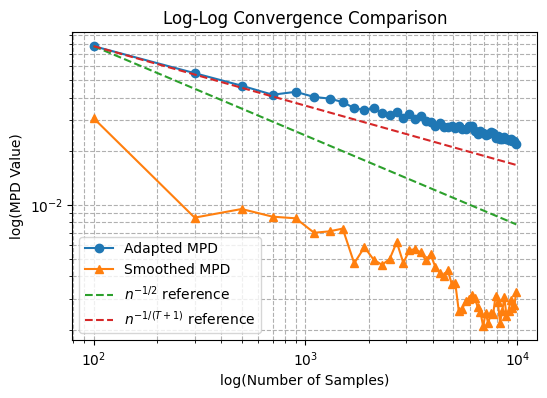
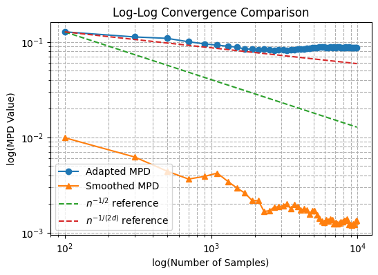

# Bicausal Wasserstein Martingale Projection
The *bicausal* or *adapted* Wasserstein martingale projection is a novel method for multi-dimensional martingale tests on data couplings. It achieves a dimension-independent convergence rate of $O(N^{1/2})$ in sample size $N$. To the best of our knowledge, it is the first **consistent** martingality test for high-dimensional regimes.

🔗 Paper link: [Empirical martingale projections via the adapted Wasserstein distance](https://arxiv.org/pdf/2401.12197)

# Abstract
Given a collection of multidimensional pairs $\{(X_i,Y_i)\}_{1 \leq i\leq n}$, we study the problem of projecting the associated suitably smoothed empirical measure onto the space of martingale couplings (i.e. distributions satisfying $\mathbb{E}[Y|X]=X$) using the adapted Wasserstein distance. We call the resulting distance the *smoothed empirical martingale projection distance* (SE-MPD), for which we obtain an explicit characterization. We also show that the space of martingale couplings remains invariant under the smoothing operation. We study the asymptotic limit of the SE-MPD, which converges at a parametric rate as the sample size increases if the pairs are either i.i.d.~or satisfy appropriate mixing assumptions. Additional finite-sample results are also investigated. Using these results, we introduce a novel consistent martingale coupling hypothesis test, which we apply to test the existence of arbitrage opportunities in recently introduced neural network-based generative models for asset pricing calibration.

  
  

  <em>Figure:</em> Log-log convergence comparison between the adapted MPD (based on the [adapted empirical distance](https://arxiv.org/abs/2002.07261)) and the smoothed MPD (ours) for <em>d = 1</em> (left) and <em>d = 3</em> (right).

# Repo Structure
IN PROGRESS
- **`scripts`**: `python` scripts for getting calibrated stock and variance trajectory using neural-SDE as followed by the pipeline developed by [Gierjatowicz et. al.](https://arxiv.org/abs/2007.04154) and getting couplings of **actual** call options payoff calculated via a nested MC conditioning on the stock price $S_t$ at each intermediate time $t$ and the
payoff estimated by coniditioning on $S_0$.

    The primary scripts are as follows:   
    - **`run_adapted_LV.py`**: Run **`adapted_LV.py`** to get stock and variance trajectory calibrated via the LV neural-SDE model.
    - **`run_adapted_LSV.py`**: Run **`adapted_LV.py`** to get stock and variance trajectory calibrated via the LSV neural-SDE model.
    - **`heston_coupling.py`**: Run **`adapted_LV.py`** to get couplings of **actual** call options payoff calculated via a nested MC conditioning on the stock price $S_t$ at each intermediate time $t$ and the payoff estimated by coniditioning on $S_0$ using a given calibrated stock trajectory.
- **`demos`**: `jupyter` tutorials for functionalities implemented in the repo. It includes demos for running the applications (such as `nsde_calibration.ipynb` for options pricing calibration) and various simulations (see `simulation.ipynb`).
- **`src`**: `python` source scripts for running the martingale test. 

